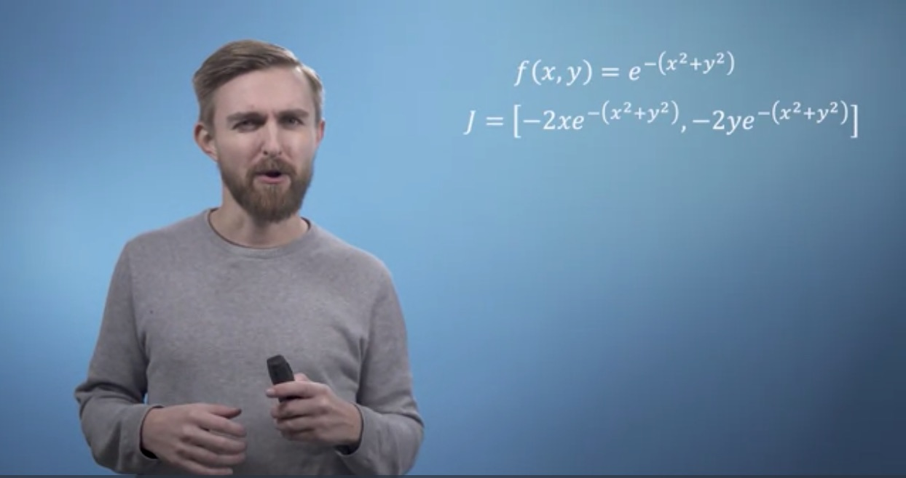

# MFML

This repository contains the notebooks I completed whilst following Imperial College's [*Mathematics for Machine Learning* coursera course](https://www.coursera.org/specializations/mathematics-machine-learning). 

*FWIW - you get a certificate of completion from the Imperial course, mine is [here](https://www.coursera.org/account/accomplishments/specialization/ARMLMTNPZJTD)*

## Notebooks

Disclaimer - I did not *create* these notebooks in this section, though I did *complete* them - they are provided by Coursera for completion as part of the assessement material for this course.

- [Transformation and change of basis](https://nbviewer.jupyter.org/github/coxy1989/mlsabbatical/blob/master/notebooks/imperial/la_ReflectingBear.ipynb)
- [Singular matrices](https://nbviewer.jupyter.org/github/coxy1989/mlsabbatical/blob/master/notebooks/imperial/la_IdentifyingSpecialMatrices.ipynb)
- [The Gram-Schmidt process](https://nbviewer.jupyter.org/github/coxy1989/mlsabbatical/blob/master/notebooks/imperial/la_GramSchmidtProcess.ipynb)
- [Power iteration and PageRank](https://nbviewer.jupyter.org/github/coxy1989/mlsabbatical/blob/master/notebooks/imperial/la_PageRank.ipynb)
- [Backpropagation](https://nbviewer.jupyter.org/github/coxy1989/mlsabbatical/blob/master/notebooks/imperial/calc_Backpropagation.ipynb)
- [Gradient Descent](https://nbviewer.jupyter.org/github/coxy1989/mlsabbatical/blob/master/notebooks/imperial/calc_Fitting%2Bthe%2Bdistribution%2Bof%2Bheights%2Bdata.ipynb)
- [Variance, covariance and affine transformation of a dataset](https://nbviewer.jupyter.org/github/coxy1989/mlsabbatical/blob/master/notebooks/imperial/pca_week1.ipynb)
- [Distance and angles in high dimensions](https://nbviewer.jupyter.org/github/coxy1989/mlsabbatical/blob/master/notebooks/imperial/pca_week2.ipynb)
- [Orthogonal Projections](https://nbviewer.jupyter.org/github/coxy1989/mlsabbatical/blob/master/notebooks/imperial/pca_week3.ipynb)
- [Implement Principal Component Analysis](https://nbviewer.jupyter.org/github/coxy1989/mlsabbatical/blob/master/notebooks/imperial/pca_week4.ipynb)
